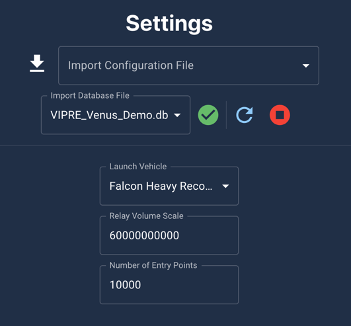
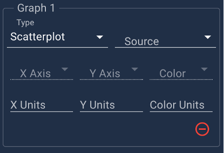
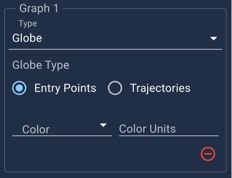
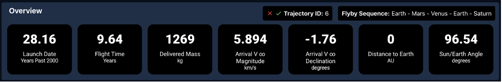
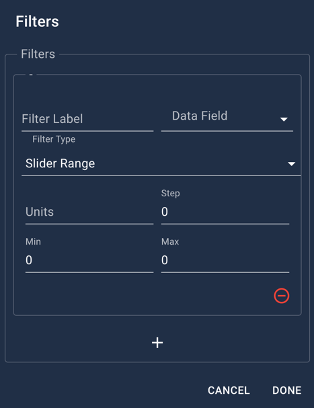
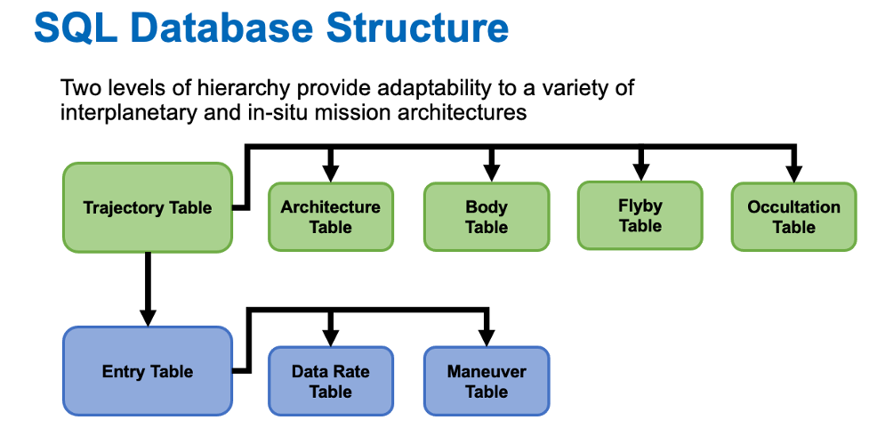

# VIPRE VISUALIZATION APPLICATION

Electron application for the Visualization of the Impact of PRobe Entry conditions on the science, mission and spacecraft design

# VIPRE GUI

The VIPRE GUI is intended for general use by members of a mission formulation or concept team. It has been designed to be intuitive and customizable for users with a variety of backgrounds. The GUI leverages precomputed SQL databases to allow for the exploration, filtering and visualization of a probe or lander mission's design tradespace. In this section we summarize user interactions with the GUI and describe SQL database generation and content later in this document. The majority of users will not need to generate databases (Section B), but may find the summary of database content in Section C of the document useful for understanding GUI filter and visualization parameters.

Users should begin interactions with the VIPRE GUI on the 'Settings' page, accessed by clicking the gear icon in the top right of the window. In the 'Settings' page users can import a configuration file, provided by the VIPRE team or another user, or download their current configuration to share. The configuration files are `.json` files used to save the filters, visualizations, and tables configured by a user and intended to aid in collaboration.

Below the configuration file dropdown are the database controls. First is the dropdown menu used to select a VIPRE database file, followed by the test, refresh, and stop buttons. Before switching databases, the user should always stop the current database with the stop button, select the new database from the dropdown, and then wait for the test button to updated from the testing display to the successful test display. Below the configuration file and database controls are the launch vehicle dropdown, used to select a launch vehicle, the relay volume scale factor, used to scale the probe-carrier telecom uplink strength, and the number of entry points for the GUI to plot. Changing the launch vehicle will update the polynomial used to calculate the delivered mass in the overview panel. Updating the relay volume scale factor allows the user to scale the data rate between the probe and carrier; the scaling factor scales the data rate when the carrier and probe are separated by 1 km with no losses or antenna pattern accounted for. The default value is calculated as 1 kbps, much weaker than a realistic telecom system, and scaling will be applied in units of kbps. It is suggested that users discuss an appropriate scaling factor with a telecom engineer. The number of entry points for the GUI to plot can be used to improve rendering speed, but should not be modified unless suggested when the database is provided to the user.

The 'GUI' page is accessed from the `Settings` page using the GUI icon. On the 'GUI' page users should first confirm that the correct target body is selected in the top-left drop down on the page. Having confirmed this, the user can begin interacting with the GUI. The majority of user interactions with the GUI are accomplished through the visualization panel in the center of the page. Without a configuration file, the visualization panel will initially appear blank with one empty tab as below:

Users can begin customizing the visualization panel by adding new tabs with the plus sign icon, or by editing a tab with the pencil icon. Clicking the pencil icon will open a tab customization window that allows the user to rename the tab or add graphs to the top and bottom rows of the tab.

Three types of graphs are available:

1. **Scatterplot** : These graphs allow the user to plot a 2-D scatterplot of X, Y, and color variables. Users must select a data source from the source dropdown first. If the user selects 'Trajectories' data from the interplanetary trajectory will be available. If the user selects 'Entries' data from the probe arrival will be available, however the scatterplot will not populate with data until an interplanetary trajectory is selected. If the user selects 'DataRates' then the scatterplot will automatically select the X and Y axis values as the time and data rate. 'DataRates' scatterplots will only populate with data based on the most recently selected entry. Once a source is selected users can select the parameters to be plotted in the appropriate dropdown. The scatterplot color does not need to be selected and can be cleared in its dropdown menu. The units of each axis will automatically populate based on database contents.

 

1. **Globe**: These graphs have two options: 'Entry Points' and 'Trajectories'. Selecting 'Entry Points' will plot all safe entry points on the target body and allow the user to color them based on a variety of entry parameters. If 'Trajectories' is selected the entry trajectory of the probe and the relay trajectory of the carrier will be plotted when an entry is selected

1. **Table** : These graphs allow the user to select a table in the database and view its raw data. The tables can be searched with the search bar and columns can be toggled on and off with the hide icon. As with the scatterplots, entry tables will not populate until a trajectory is selected and data rate tables will populate with the most recently selected entry.

When user begins interacting with the visualization panel, the overview panel will also begin to populate at the top of the page. The overview panel provides a summary of the interplanetary trajectory and allows the user to confirm a trajectory selection.

The overview panel will first populate when a user selects an interplanetary trajectory, either by clicking a point on a 'Trajectories' Scatterplot or a 'Trajectory' Table. The overview supplements the mouseover tooltips with a summary of the selected trajectory. To confirm a trajectory selection, such that entry data populates the user clicks the green check button next to the 'Trajectory ID'. Trajectories can be deselected by instead clicking the red X button.

The final panel on the 'GUI' page is the filtering panel. The filtering panel allows the user to filter interplanetary trajectory data or arrival data based on the parameters present in the database.

To add or edit filters the user must select the pencil icon in the top left of the panel this allows the user to access the filter editing window. On the filter editing window users can add filters with the plus sign button and initialize or modify filters. Filters allow for the user to label a filter, select a data source to filter with and select a filter type. Three filter types are available: 'Date Range' for time data, 'Slider Range' for numerical range data (for which a step, min, and max value need to be entered), and 'Select' for data tags, flags and other string options. In the case of a 'Select' filter, the user must manually add options based on the database contents by typing in the option and clicking the 'add' text popup. Options can be identified by using a Table visualization to inspect the filtering field's content. To see what database values can be used for filtering in detail see section Section C. The user should be aware that when a filter is initially created it will default to 0 and generally filter out all data. The user should set the filter settings in the filter panel to repopulate the data based on reasonable filter values.

In the case of confusion about what a particular data value or parameter represents the user should read Section C to see the SQL database field names and associated descriptions and details

# B. Database Generation

The VIPRE database generation toolset is a set of Matlab functions that allows the user to generate a VIPRE database. The toolset can be found on the VIPRE Github along with the example database generation script 'VIPRE\_flow.m'. In addition to these files, users will need STAR or a similar tool to search for and identify interplanetary trajectories. The best method of understanding VIPRE database generation is to follow the example set in 'VIPRE\_flow.m' and the database description in Section C. To aid this process this section of the User Guide describes the steps in 'VIPRE\_flow.m' and provides a short summary of the functions in the database generation toolset. It should also be noted that database generation can be performed with any programming language of software tool capable of writing SQL databases, assuming the trajectory and telecom analysis data can be generated with a different set of tools.

## VIPRE_flow.m
This script is an example of database generation for a carrier spacecraft which and releases a probe 100 days before the probe enters Saturn's atmosphere and diverts to perform a flyby of Saturn. As the probe descends for 90 minutes, it relays data to the carrier spacecraft. The VIPRE toolset is used here to investigate the data volume that can be returned to the carrier for a variety of probe entry locations at the end of each interplanetary trajectory. After the database has been generated, the user can load it into the VIPRE GUI and further explore, filter, and visualize the data. The interplanetary trajectories for this case have been precomputed with STAR and delivered in 'E\_S\_test.tar.gz'. See STAR documentation for a description of its use. Because of version dependencies, this script should be run with MATLAB 2020b or certain function with need to be replaced (insert and pagemtimes). The process within 'VIPRE\_flow.m' is as follows:

1. The first step in the database generation process is to name the database, initialize the SQL structure and prepare Matlab database tracking structures. This is accomplished using 'init\_vipre\_db' and 'sql\_structure' to initialize the database and then create an internal structure to track the contents of the database.
2. With the database initialized, a STAR output file must be defined and read with the STAR 'Sread' tool. This extracts the trajectory velocities, deltaV's and other parameters.
3. The probe relay and descent parameters are next defined. This includes selecting the atmospheric and opacity profiles to be used (see Atm Profiles.xlsx and Planetary Opacities.xlsx). Based on the atmospheric profile selected, a reference altitude for 1 bar pressure must be set. This is recorded within the selected Atm Profiles.xlsx sheet. The other necessary relay and descent parameters are the duration of the probe relay, the pressure limit for probe descent and the minimum safe communication altitude for the carrier.
4. In the case that raw STAR output is used, the trajectories must next be filtered for unique arrival at the target body.
5. The entry sites are next defined based on a uniform spherical distribution of points on surface of the target body. The user can choose to prefilter and entry location at this step in the case that certain locations, latitudes, or longitudes are undesirable. This filtering can also be set in the GUI, but the database will be larger.
6. If the database will contain multiple target bodies, a loop can be defined to step through trajectories for each unique target body. Similarly, if the target body has rings, their inner and out radius can be set for hazard detection during entry trajectory calculations
7. Given a target body, the STAR trajectories can be looped through to pack the Trajectory Table. Before computing trajectory data, the Body and Architecture tables are generated for the current trajectory. In each of these cases, the contents of the tables are checked to prevent duplication of body and architecture records.
8. Several characteristics of the interplanetary trajectory must be calculated with 'conic\_arc', 'get\_true\_anomaly', and 'find\_tof'. These functions provide the arrival velocity, positions and angles relative to the Sun, Earth, and Target body. These parameters, along with those unpacked from the STAR data are rotated into the appropriate frame and then inserted into the Trajectory table.
9. The Trajectory table parameters and unpacked STAR parameters are also used to insert data into the Flyby table. Likewise, the interplanetary occultations are identified with 'find\_occultation' and inserted into the Occultation table.
10. Having computed the interplanetary trajectory parameters and arrival characteristics, arrival maneuver calculations begin. In the example case of 'VIPRE\_flow.m' the carrier spacecraft performs a divert maneuver to fly over the probe as it descends. Other carrier orbits and maneuvers can be implemented in VIPRE, but the user should read Section C to ensure they understand how to appropriately build databases for these cases.
11. The carrier divert maneuver described in the step above is calculated using 'lambert\_relay\_divert', which in this case is set to target a carrier relay orbit at the minimum safe communication altitude, while simultaneously avoiding collisions with Saturn's rings. This maneuver is identified for each entry location marked as safe by prior steps in the script.
12. For each entry location marked as safe the B-plane parameters are calculated using the 'Bplane' function.
13. Using the calculated relay maneuver the probe descent and relay can be modeled. The probe descent from the entry point and carrier position throughout the relay period are computed with 'probe\_descent\_vectorized' for each entry location and associated carrier divert state. Then the probe and carrier relay states are input into 'telecom\_check' in order to model the uplink data rate and data volume for each probe entry location. For compact storage in the database, the data rate time series is down-sampled to a subset of points on the curve with 'downsample\_paired'
14. This completes the VIPRE model of interplanetary trajectory, entry maneuvers, and descent relay modeling. Some final parameter calculations are performed for the Entry, Maneuver, and Datarate tables and then the computed data is inserted into the appropriate database tables.
15. This overall process continues as 'VIPRE\_flow.m' iterates through interplanetary trajectories provided by the STAR database until all calculations have been made and database generation has been completed.

The following function summaries provide a general description of the VIPRE toolset functions. More description of the inputs and outputs can be found within the Matlab function files.

**init\_vipre\_db** – Sends SQL commands to initialize the newly defined database. All table structures and associated indices are defined here. More specifications can be found in Section C or on the VIPRE schema github.

**sql\_structure** – Initializes Matlab database housekeeping structures to track database content and labels within the database generation script.

**conic\_arc** – Generates a conic arc between two orbit states with equal spaced true anomaly points along the conic. Options to track the number of revolutions and time at each point along the conic. Capable of generating an arbitrary number of conic arcs given the associated number of inputs.

**get\_true\_anomaly** – Computes true anomaly along a conic based on orbital state, eccentricity, and semi parameter

**find\_tof\_arr** – Uses standard Kepler's equation algorithm to calculate the time to travel to a specified orbital position based on a reference position on the same orbit. Capable of computing the time of flight for an arbitrarily sized array of inputs.

**find\_occultation** – Differential corrector to identify occultations based on the angular separation between a spacecraft and target body.

**lambert\_relay\_divert** – Computes a Lambert arc between carrier divert state and a minimum safe altitude carrier relay geometry location to target for probe telecom relay. Performs hazard detection and reevaluates carrier maneuver if the trajectory is unsafe.

**Bplane** – Calculates the B-plane radius and angle given the orbit normal, target body spin pole, and incoming V-infinity

**probe\_descent\_vectorized** – Computes the carrier spacecraft trajectory arc from the moment of probe entry to the end of the probe relay period. Simultaneously, calculates a linearized vertical descent of the probe from the point of entry to the pressure limit given the user input descent time. Accounts for probe rotation with the planetary spin. Capable of generating an arbitrary number of states based on the appropriate number of inputs

**telecom\_check** – Uses the carrier and probe state computed by 'probe\_descent\_vectorized' to model the uplink data rate from the probe to the carrier spacecraft accounting for antenna signal shape ('GSignori.txt'), atmospheric pressure and opacity ('Atm Profiles.xlsx', 'Planetary Opacities.xlsx') and assuming a normalized uplink data rate of 1 kbps at 1 km of separation when ignoring losses. The uplink rate can be scaled simply from this normalized value within the GUI based on approximate values provided by a telecom engineer. Also provides the total uplinked data volume and cumulative data volume. Capable of generating an arbitrary number of states based on the appropriate number of inputs.

**downsample\_paired** – Downsamples timeseries data based on a user input. Used to down select the dense uplink data rate time series produced by 'telecom\_check' for representation within the VIPRE GUI

# C. SQL Database

VIPRE is designed around an adaptable SQL database whose structure enables mission architecture flexibility. The SQL database structure, shown in the figure below, illustrates the relies on a hierarchical relational structure. At the highest level is the Trajectory table which contains data on the interplanetary leg of the trajectory. As the lower level of the hierarchy is the Entry table which contains data on possible entries associated with each Trajectory. Each of these two tables has an associated subset of tables which provide information associated with either a specific trajectory or entry. A row in each table contains all information for a single independent record identified with an id and linked to records in other tables with an id correlated to the other tables. As an example, one row of the trajectory table defines a single trajectory with an assigned trajectory id; records in the Architecture, Body, Flyby, Occultation, and Entry tables may be associated to this trajectory by referencing the associated trajectory id. In many cases an arbitrary number of records in one table may be associated with a single record in another table. For instance, one trajectory record will have thousands of entry records associated with it, indicating that all of those entries arrive at the target body on that one trajectory. Likewise, there may be several points in the data rate time series associated with one entry, thus several Data Rate table entries will reference the entry id associated with that specific entry record. Use of ids in this way allows a single iteration of each table to store both the data and relational structure needed for the entire set of trajectories, entries, etc.

In the following section the contents of a single record for each table type is described. The field name for each field provides the tag used in the VIPRE GUI and the column labels for database generation. If a field can be filtered in the GUI, the filtering type is described by the filtering demarcation. In the case that a field is marked as nullable, it does not need to be provided in the database. The units of a field are the expected units to for the value provided in database generation and for labeling in the GUI.

## Trajectory Table ([https://github.com/jpl-vipre/vipre-schemas/blob/main/models/vipre\_schema-trajectory.json](https://github.com/jpl-vipre/vipre-schemas/blob/main/models/vipre_schema-trajectory.json))

| Field Label                                       | Field Name        | Filtering | Nullable | Units                                          | Description                                                                                                                                 |
| ------------------------------------------------- | ----------------- | --------- | -------- | ---------------------------------------------- | ------------------------------------------------------------------------------------------------------------------------------------------- |
| ID                                                | id                | n/a       | no       | n/a                                            | Numeric id to identify each entry in the table.                                                                                             |
| Body ID                                           | body_id           | n/a       | no       | n/a                                            | Horizons id (or other id used in the Body table) of target body for trajectory. This links the target to the information in the target body |
| Architecture ID                                   | architecture_id   | n/a       | no       | n/a                                            | id of trajectory flyby architecture. This links the trajectory to the architecture in the architecture table                                |
| Launch Date                                       | t_launch          | date      | no       | seconds past J2000 (rounded to nearest second) | Trajectory launch date                                                                                                                      |
| Arrival Date                                      | t_arr             | date      | no       | seconds past J2000 (rounded to nearest second) | Trajectory arrival date                                                                                                                     |
| Arrival V_infinity Vector X-Component             | v_inf_arr_x       | n/a       | no       | km/s                                           | X-component of the arrival V_infinity at the target body in the target body pole-aligned inertial frame                                     |
| Arrival V_infinity Vector Y-Component             | v_inf_arr_y       | n/a       | no       | km/s                                           | Y-component of the arrival V_infinity at the target body in the target body pole-aligned inertial frame                                     |
| Arrival V_infinity Vector Z-Component             | v_inf_arr_z       | n/a       | no       | km/s                                           | Z-component of the arrival V_infinity at the target body in the target body pole-aligned inertial frame                                     |
| Arrival V_infinity Vector Magnitude               | v_inf_arr_mag     | slider    | no       | km/s                                           | Magnitude of the arrival V_infinity at the target body in the target body pole-aligned inertial frame                                       |
| Arrival V_infinity Vector Declination             | v_inf_arr_dec     | slider    | no       | deg                                            | Declination of the arrival V_infinity at the target body in the target body pole-aligned inertial frame                                     |
| Arrival V_infinity Vector Right Ascension         | v_inf_arr_ra      | slider    | no       | deg                                            | Right Ascension of the arrival V_infinity at the target body in the target body pole-aligned inertial frame                                 |
| Launch C3                                         | c3                | slider    | no       | km^2/s^2                                       | Characteristic energy of trajectory launch                                                                                                  |
| Interplanetary DeltaV                             | interplanetary_dv | slider    | no       | km/s                                           | Total deltaV for interplanetary trajectory (before orbit insertion)                                                                         |
| Solar Phase Angle                                 | solar_phase_angle | slider    | no       | deg                                            | Solar phase angle at trajectory arrival (Sun-Target body-V_infinity angle)                                                                  |
| Solar Conjunction Angle                           | solar_conj_angle  | slider    | no       | deg                                            | Solar conjunction angle at trajectory arrival (Earth-Target body angle-Sun)                                                                 |
| Solar Incidence Angle                             | solar_inc_angle   | n/a       | no       | deg                                            | Solar incidence angle at trajectory arrival (Sun-Target body-Arrival Position angle)                                                        |
| Earth Position at Arrival Vector X-Component      | pos_earth_arr_x   | n/a       | no       | AU                                             | X-component of the position of the Earth relative to the sun in the target body pole-aligned inertial frame                                 |
| Earth Position at Arrival Vector Y-Component      | pos_earth_arr_y   | n/a       | no       | AU                                             | Y-component of the position of the Earth relative to the sun in the target body pole-aligned inertial frame                                 |
| Earth Position at Arrival Vector Z-Component      | pos_earth_arr_z   | n/a       | no       | AU                                             | Z-component of the position of the Earth relative to the sun in the target body pole-aligned inertial frame                                 |
| Earth Point Latitude at Arrival                   | pos_earth_arr_lat | slider    | no       | AU                                             | Latitude of the Target body-Earth line in the target body frame at the time of arrival                                                      |
| Earth Point Longitude at Arrival                  | pos_earth_arr_lon | slider    | no       | AU                                             | Longitude of the Target body-Earth line in the target body frame at the time of arrival                                                     |
| Spacecraft Position at Arrival Vector X-Component | pos_sc_arr_x      | n/a       | no       | AU                                             | X-component of the position of the Spacecraft relative to the sun in the target body pole-aligned inertial frame                            |
| Spacecraft Position at Arrival Vector Y-Component | pos_sc_arr_y      | n/a       | no       | AU                                             | Y-component of the position of the Spacecraft relative to the sun in the target body pole-aligned inertial frame                            |
| Spacecraft Position at Arrival Vector Z-Component | pos_sc_arr_z      | n/a       | no       | AU                                             | Z-component of the position of the Spacecraft relative to the sun in the target body pole-aligned inertial frame                            |
| Target Position at Arrival Vector X-Component     | pos_target_arr_x  | n/a       | no       | AU                                             | X-component of the position of the target relative to the sun in the target body pole-aligned inertial frame                                |
| Target Position at Arrival Vector Y-Component     | pos_target_arr_y  | n/a       | no       | AU                                             | Y-component of the position of the target relative to the sun in the target body pole-aligned inertial frame                                |
| Target Position at Arrival Vector Z-Component     | pos_target_arr_z  | n/a       | no       | AU                                             | Z-component of the position of the target relative to the sun in the target body pole-aligned inertial frame                                |
| Sun Point Latitude at Arrival                     | pos_sun_arr_lat   | slider    | no       | AU                                             | Latitude of the Target body-Sun line in the target body frame at the time of arrival                                                        |
| Sun Point Longitude at Arrival                    | pos_sun_arr_lon   | slider    | no       | AU                                             | Longitude of the Target body-Sun line in the target body frame at the time of arrival                                                       |
|                                                   |                   |           |          |                                                |                                                                                                                                             |

## Architecture Table ([https://github.com/jpl-vipre/vipre-schemas/blob/main/models/vipre\_schema-architecture.json](https://github.com/jpl-vipre/vipre-schemas/blob/main/models/vipre_schema-architecture.json))

| Field Label | Field Name | Filtering | Nullable | Units | Description                                                                                                                             |
| ----------- | ---------- | --------- | -------- | ----- | --------------------------------------------------------------------------------------------------------------------------------------- |
| ID          | id         | checkbox  | no       | n/a   | Numeric id to identify each entry in the table.                                                                                         |
| Sequence    | sequence   | checkbox  | no       | n/a   | String of Horizons id's for flyby bodies, begins with Earth as launch body and ends with target body. EX) "399 - 299 - 299 - 399 - 699" |

## Body Table ([https://github.com/jpl-vipre/vipre-schemas/blob/main/models/vipre\_schema-body.json](https://github.com/jpl-vipre/vipre-schemas/blob/main/models/vipre_schema-body.json))

| Field Label                       | Field Name | Filtering | Nullable | Units    | Description                                                                                                                                    |
| --------------------------------- | ---------- | --------- | -------- | -------- | ---------------------------------------------------------------------------------------------------------------------------------------------- |
| ID                                | id         | checkbox  | no       | n/a      | Numeric id to identify each entry in the table.                                                                                                |
| Name                              | name       | checkbox  | no       | n/a      | Name of flyby or target body                                                                                                                   |
| Radius                            | radius     | n/a       | no       | km       | Radius of body                                                                                                                                 |
| Gravity parameter                 | mu         | n/a       | no       | km^3/s^2 | Gravity parameter of the body                                                                                                                  |
| Spin Period                       | period     | n/a       | no       | days/rev | Rotational period of body, negative if spinning left-handed                                                                                    |
| Spin Pole Unit Vector X-Component | pole_vec_x | n/a       | no       | unit     | X-component of the body spin pole unit vector, if spinning left-handed the pole should still point in the right hand direction (JPL Horizons   |
| Spin Pole Unit Vector Y-Component | pole_vec_y | n/a       | no       | unit     | Y-component of the body spin pole unit vector, if spinning left-handed the pole should still point in the right hand direction (JPL Horizons   |
| Spin Pole Unit Vector Z-Component | pole_vec_z | n/a       | no       | unit     | Z-component of the body spin pole unit vector, if spinning left-handed the pole should still point in the right-handed direction (JPL Horizons |

## Flyby Table ([https://github.com/jpl-vipre/vipre-schemas/blob/main/models/vipre\_schema-flyby.json](https://github.com/jpl-vipre/vipre-schemas/blob/main/models/vipre_schema-flyby.json))

| Field Label                            | Field Name      | Filtering | Nullable | Units              | Description                                           |
| -------------------------------------- | --------------- | --------- | -------- | ------------------ | ----------------------------------------------------- |
| ID                                     | id              | n/a       | no       | n/a                | Numeric id to identify each entry in the table.       |
| Trajectory ID                          | trajectory_id   | n/a       | no       | n/a                | id of associated trajectory that performs the flyby   |
| Body ID                                | body_id         | checkbox  | no       | n/a                | id of flyby body                                      |
| Order                                  | order           | n/a       | no       | n/a                | Order of flyby in architecture sequence               |
| Time of Flyby                          | t_flyby         | n/a       | no       | seconds past J2000 | Time that the flyby occurs                            |
| Altitude                               | altitude        | n/a       | no       | km                 | Periapsis altitude of flyby above body                |
| Incoming V_infinity Vector X-Component | v_inf_in_x      | n/a       | no       | km/s               | X-component of the approach V_infinity for the flyby  |
| Incoming V_infinity Vector Y-Component | v_inf_in_y      | n/a       | no       | km/s               | Y-component of the approach V_infinity for the flyby  |
| Incoming V_infinity Vector Z-Component | v_inf_in_z      | n/a       | no       | km/s               | Z-component of the approach V_infinity for the flyby  |
| Incoming V_infinity Vector Magnitude   | v_inf_in_mag    | n/a       | no       | km/s               | Magnitude of the approach V_infinity for the flyby    |
| Outgoing V_infinity Vector X-Component | v_inf_out_x     | n/a       | no       | km/s               | X-component of the departing V_infinity for the flyby |
| Outgoing V_infinity Vector Y-Component | v_inf_ out _y   | n/a       | no       | km/s               | Y-component of the departing V_infinity for the flyby |
| Outgoing V_infinity Vector Z-Component | v_inf_ out _z   | n/a       | no       | km/s               | Z-component of the departing V_infinity for the flyby |
| Outgoing V_infinity Vector Magnitude   | v_inf_ out _mag | n/a       | no       | km/s               | Magnitude of the departing V_infinity for the flyby   |

## Occultation Table ([https://github.com/jpl-vipre/vipre-schemas/blob/main/models/vipre\_schema-occultation.json](https://github.com/jpl-vipre/vipre-schemas/blob/main/models/vipre_schema-occultation.json))

| Field Label               | Field Name    | Filtering | Nullable | Units              | Description                                         |
| ------------------------- | ------------- | --------- | -------- | ------------------ | --------------------------------------------------- |
| ID                        | id            | n/a       | no       | n/a                | Numeric id to identify each entry in the table.     |
| Trajectory ID             | trajectory_id | n/a       | no       | n/a                | id of associated trajectory that performs the flyby |
| Time Entering Occultation | t_occ_in      | n/a       | yes      | seconds past J2000 | Time that the spacecraft enters occultation         |
| Time Exiting Occultation  | t_occ_out     | n/a       | yes      | seconds past J2000 | Time that the spacecraft exits occultation          |

## Entry Table ([https://github.com/jpl-vipre/vipre-schemas/blob/main/models/vipre\_schema-entry.json](https://github.com/jpl-vipre/vipre-schemas/blob/main/models/vipre_schema-entry.json))

| Field Label                                          | Field Name            | Filtering                                                                     | Nullable | Units                                          | Description                                                                                                                                      |
| ---------------------------------------------------- | --------------------- | ----------------------------------------------------------------------------- | -------- | ---------------------------------------------- | ------------------------------------------------------------------------------------------------------------------------------------------------ |
| ID                                                   | id                    | n/a                                                                           | no       | n/a                                            | Numeric id to identify each entry in the table.                                                                                                  |
| Body ID                                              | body\_id              | n/a                                                                           | no       | n/a                                            | Horizons id (or other id used in the Body table) of target body for the entry. This links the target to the information in the target body       |
| Trajectory ID                                        | trajectory\_id        | n/a                                                                           | no       | n/a                                            | id of associated trajectory that the entry arrives on. This links the entry to the information in the trajectory table                           |
| Bplane Angle                                         | bvec\_theta           | slider                                                                        | no       | rad                                            | Bplane angle needed to reach the entry location                                                                                                  |
| Bplane Radius                                        | bvec\_mag             | slider                                                                        | no       | km                                             | Bplane radius needed to reach the entry location                                                                                                 |
| Safety Flag                                          | safe                  | n/a                                                                           | no       | n/a                                            | Flag indicating that the entry is safe when set to 1 and unsafe when set to 0                                                                    |
| Probe Entry Time                                     | t\_entry              | date                                                                          | no       | seconds past J2000 (rounded to nearest second) | Time that the probe reaches the entry interface                                                                                                  |
| Probe Entry Position Vector X-Component              | pos\_entry\_x         | n/a                                                                           | yes      | km                                             | X-component of the position of the Probe relative to the target body in the body fixed frame                                                     |
| Probe Entry Position Vector Y-Component              | pos\_entry\_y         | n/a                                                                           | yes      | km                                             | Y-component of the position of the Probe relative to the target body in the body fixed frame                                                     |
| Probe Entry Position Vector Z-Component              | pos\_entry\_z         | n/a                                                                           | yes      | km                                             | Z-component of the position of the Probe relative to the target body in the body fixed frame                                                     |
| Probe Entry Position Vector Magnitude                | pos\_entry\_mag       | slider                                                                        | yes      | km                                             | Magnitude of the position of the Probe relative to the target body in the body fixed frame                                                       |
| Probe Entry Position Vector Latitude                 | pos\_entry\_lat       | slider                                                                        | yes      | deg                                            | Latitude of the position of the Probe relative to the target body in the body fixed frame                                                        |
| Probe Entry Position Vector Longitude                | pos\_entry\_lon       | slider                                                                        | yes      | deg                                            | Longitude of the position of the Probe relative to the target body in the body fixed frame                                                       |
| Probe Entry Velocity Vector X-Component              | vel\_entry\_x         | n/a                                                                           | yes      | km/s                                           | X-component of the velocity of the Probe relative to the target body in the body aligned frame not accounting for planetary rotation             |
| Probe Entry Velocity Vector Y-Component              | vel\_entry\_y         | n/a                                                                           | yes      | km/s                                           | Y-component of the velocity of the Probe relative to the target body in the body aligned frame not accounting for planetary rotation             |
| Probe Entry Velocity Vector Z-Component              | vel\_entry\_z         | n/a                                                                           | yes      | km/s                                           | Z-component of the velocity of the Probe relative to the target body in the body aligned frame not accounting for planetary rotation             |
| Probe Entry Velocity Vector Magnitude                | vel\_entry\_mag       | slider                                                                        | yes      | km/s                                           | Magnitude of the velocity of the Probe relative to the target body in the body aligned frame not accounting for planetary rotation               |
| Probe Entry Velocity Vector Declination              | vel\_entry\_dec       | slider                                                                        | yes      | deg                                            | Declination of the velocity of the Probe relative to the target body in the body aligned frame not accounting for planetary rotation             |
| Probe Entry Velocity Vector Right Ascension          | vel\_entry\_ra        | slider                                                                        | yes      | deg                                            | Right Ascension of the velocity of the Probe relative to the target body in the body aligned frame not accounting for planetary rotation         |
| Entry Flight Path Angle                              | flight\_path\_angle   | slider                                                                        | yes      | deg                                            | Flight path angle of the probe at the time of entry                                                                                              |
| Solar Phase Angle                                    | solar\_phase\_angle   | slider                                                                        | yes      | deg                                            | Solar phase angle at time of entry (Sun-Target body-V\_infinity angle)                                                                           |
| Solar Conjunction Angle                              | solar\_conj\_angle    | slider                                                                        | yes      | deg                                            | Solar conjunction angle at time of entry (Earth-Target body angle-Sun)                                                                           |
| Solar Incidence Angle                                | solar\_inc\_angle     | n/a                                                                           | yes      | deg                                            | Solar incidence angle time of entry (Sun-Target body-Entry position angle)                                                                       |
| Sun Position at Entry Vector X-Component             | pos\_sun\_entry\_x    | n/a                                                                           | yes      | AU                                             | X-component of the position of the Sun relative to the target body in the target body-fixed frame at the time of entry                           |
| Sun Position at Entry Vector Y-Component             | pos\_sun\_entry\_y    | n/a                                                                           | yes      | AU                                             | Y-component of the position of the Sun relative to the target body in the target body-fixed frame at the time of entry                           |
| Sun Position at Entry Vector Z-Component             | pos\_sun\_entry\_z    | n/a                                                                           | yes      | AU                                             | Z-component of the position of the Sun relative to the target body in the target body-fixed frame at the time of entry                           |
| Earth Position at Entry Vector X-Component           | pos\_earth\_entry\_x  | n/a                                                                           | yes      | AU                                             | X-component of the position of the Earth relative to the target body in the target body-fixed frame at the time of entry                         |
| Earth Position at Entry Vector Y-Component           | pos\_earth\_entry\_y  | n/a                                                                           | yes      | AU                                             | Y-component of the position of the Earth relative to the target body in the target body-fixed frame at the time of entry                         |
| Earth Position at Entry Vector Z-Component           | pos\_earth\_entry\_z  | n/a                                                                           | yes      | AU                                             | Z-component of the position of the Earth relative to the target body in the target body-fixed frame at the time of entry                         |
| Target Position at Entry Vector X-Component          | pos\_target\_entry\_x | n/a                                                                           | yes      | AU                                             | X-component of the position of the target relative to the target body in the target body-fixed frame at the time of entry                        |
| Target Position at Entry Vector Y-Component          | pos\_target\_entry\_y | n/a                                                                           | yes      | AU                                             | Y-component of the position of the target relative to the target body in the target body-fixed frame at the time of entry                        |
| Target Position at Entry Vector Z-Component          | pos\_target\_entry\_z | n/a                                                                           | yes      | AU                                             | Z-component of the position of the target relative to the target body in the target body-fixed frame at the time of entry                        |
| Rotating Probe Entry Velocity Vector X-Component     | rot\_vel\_entry\_x    | n/a                                                                           | yes      | km/s                                           | X-component of the velocity of the Probe relative to the target body in the body aligned frame accounting for planetary rotation                 |
| Rotating Probe Entry Velocity Vector Y-Component     | rot\_vel\_entry\_y    | n/a                                                                           | yes      | km/s                                           | Y-component of the velocity of the Probe relative to the target body in the body aligned frame accounting for planetary rotation                 |
| Rotating Probe Entry Velocity Vector Z-Component     | rot\_vel\_entry\_z    | n/a                                                                           | yes      | km/s                                           | Z-component of the velocity of the Probe relative to the target body in the body aligned frame accounting for planetary rotation                 |
| Rotating Probe Entry Velocity Vector Magnitude       | rot\_vel\_entry\_mag  | slider                                                                        | yes      | km/s                                           | Magnitude of the velocity of the Probe relative to the target body in the body aligned frame accounting for planetary rotation                   |
| Rotating Probe Entry Velocity Vector Declination     | rot\_vel\_entry\_dec  | slider                                                                        | yes      | deg                                            | Declination of the velocity of the Probe relative to the target body in the body aligned frame accounting for planetary rotation                 |
| Rotating Probe Entry Velocity Vector Right Ascension | rot\_vel\_entry\_ra   | slider                                                                        | yes      | deg                                            | Right Ascension of the velocity of the Probe relative to the target body in the body aligned frame accounting for planetary rotation             |
| Probe Relay Data Volume                              | relay\_volume         | slider (scales with the data scaling value in the VIPRE GUI Settings section) | yes      | Kbits                                          | Total data volume returned by the probe. The value is based on a normalized data rate of 1 kbps at 1 km when ignoring losses. The scaling factor |
| Ring Shadow Flag                                     | ring\_shadow          | checkbox                                                                      | yes      | n/a                                            | Flag indicating that the entry is in shadow of the rings if set to 1 and out of the shadow when set to 0. Do not add to the database or set to 0 |
| Carrier Orbit Type                                   | carrier\_orbit        | checkbox                                                                      | yes      | n/a                                            | String indicating if the carrier releases the probe from a flyby or elliptical orbit. Set as 'flyby' for a flyby and 'orbit' for an elliptical   |

## Maneuver Table ([https://github.com/jpl-vipre/vipre-schemas/blob/main/models/vipre\_schema-maneuver.json](https://github.com/jpl-vipre/vipre-schemas/blob/main/models/vipre_schema-maneuver.json))

| Field Label                         | Field Name        | Filtering | Nullable | Units                                          | Description                                                                                                                                                                                                                                                                                                                                                                                                                                                                                                                                                                                                                                                                             |
| ----------------------------------- | ----------------- | --------- | -------- | ---------------------------------------------- | --------------------------------------------------------------------------------------------------------------------------------------------------------------------------------------------------------------------------------------------------------------------------------------------------------------------------------------------------------------------------------------------------------------------------------------------------------------------------------------------------------------------------------------------------------------------------------------------------------------------------------------------------------------------------------------- |
| ID                                  | id                | n/a       | no       | n/a                                            | Numeric id to identify each entry in the table.                                                                                                                                                                                                                                                                                                                                                                                                                                                                                                                                                                                                                                         |
| Entry ID                            | entry_id          | n/a       | no       | n/a                                            | id of associated entry that performs the maneuver                                                                                                                                                                                                                                                                                                                                                                                                                                                                                                                                                                                                                                       |
| Maneuver Type                       | maneuver_type     | n/a       | yes      | n/a                                            | Type of maneuver described in this table record. This value is used to select for visualization: the probe trajectory will be propagated from the initial state of a maneuver labeled 'divert' and the carrier trajectory will be propagated from the state of the maneuver with the dV added, up to the end of the probe relay period. If the carrier is an orbiter (or if there is another maneuver you wish to visualize before separation) include it as an 'insert' maneuver (an label the carrier_orbit in the entries table as 'orbit'). The visualization will propagate the carrier from the 'insert' maneuver state with the dV added to the initial 'divert' maneuver state. |
| Time of Maneuver                    | time\_man         | n/a       | yes      | seconds past J2000 (rounded to nearest second) | Time at which the specified maneuver occurs. Assumes instantaneous maneuvers                                                                                                                                                                                                                                                                                                                                                                                                                                                                                                                                                                                                            |
| Maneuver DeltaV Vector X-Component  | dv\_maneuver\_x   | n/a       | yes      | km/s                                           | X-component of the maneuver deltaV in the target body pole-aligned inertial frame                                                                                                                                                                                                                                                                                                                                                                                                                                                                                                                                                                                                       |
| Maneuver DeltaV Vector Y-Component  | dv\_maneuver\_y   | n/a       | yes      | km/s                                           | Y-component of the maneuver deltaV in the target body pole-aligned inertial frame                                                                                                                                                                                                                                                                                                                                                                                                                                                                                                                                                                                                       |
| Maneuver DeltaV Vector Z-Component  | dv\_maneuver\_z   | n/a       | yes      | km/s                                           | Z-component of the maneuver deltaV in the target body pole-aligned inertial frame                                                                                                                                                                                                                                                                                                                                                                                                                                                                                                                                                                                                       |
| Maneuver DeltaV Vector Magnitude    | dv\_maneuver\_mag | slider    | yes      | km/s                                           | Magnitude of the maneuver deltaV in the target body pole-aligned inertial frame                                                                                                                                                                                                                                                                                                                                                                                                                                                                                                                                                                                                         |
| Initial Position Vector X-Component | pos\_man\_x       | n/a       | yes      | km                                             | X-component of the position of the maneuver as the deltaV is applied in the target body pole-aligned inertial frame                                                                                                                                                                                                                                                                                                                                                                                                                                                                                                                                                                     |
| Initial Position Vector Y-Component | pos\_man\_y       | n/a       | yes      | km                                             | Y-component of the position of the maneuver as the deltaV is applied in the target body pole-aligned inertial frame                                                                                                                                                                                                                                                                                                                                                                                                                                                                                                                                                                     |
| Initial Position Vector Z-Component | pos\_man\_z       | n/a       | yes      | km                                             | Z-component of the position of the maneuver as the deltaV is applied in the target body pole-aligned inertial frame                                                                                                                                                                                                                                                                                                                                                                                                                                                                                                                                                                     |
| Initial Velocity Vector X-Component | vel\_man\_x       | n/a       | yes      | km                                             | X-component of the velocity of the maneuver before the deltaV is applied in the target body pole-aligned inertial frame                                                                                                                                                                                                                                                                                                                                                                                                                                                                                                                                                                 |
| Initial Velocity Vector Y-Component | vel\_man\_y       | n/a       | yes      | km                                             | Y-component of the velocity of the maneuver before the deltaV is applied in the target body pole-aligned inertial frame                                                                                                                                                                                                                                                                                                                                                                                                                                                                                                                                                                 |
| Initial Velocity Vector Z-Component | vel\_man\_z       | n/a       | yes      | km                                             | Z-component of the velocity of the maneuver before the deltaV is applied in the target body pole-aligned inertial frame                                                                                                                                                                                                                                                                                                                                                                                                                                                                                                                                                                 |

## Datarate Table ([https://github.com/jpl-vipre/vipre-schemas/blob/main/models/vipre\_schema-datarate.json](https://github.com/jpl-vipre/vipre-schemas/blob/main/models/vipre_schema-datarate.json))

| Field Label | Field Name | Filtering | Nullable | Units                                                                                      | Description                                                                                                |
| ----------- | ---------- | --------- | -------- | ------------------------------------------------------------------------------------------ | ---------------------------------------------------------------------------------------------------------- |
| ID          | id         | n/a       | no       | n/a                                                                                        | Numeric id to identify each entry in the table.                                                            |
| Entry ID    | entry\_id  | n/a       | no       | n/a                                                                                        | id of associated entry                                                                                     |
| Order       | order      | n/a       | no       | n/a                                                                                        | Order of this data rate and time pair for the associate entry's data rate time series. Should be an index. |
| Time        | time       | n/a       | yes      | Seconds after probe entry time                                                             | Time value for this point in the entry's data rate time series                                             |
| Data Rate   | rate       | n/a       | yes      | kbps (The value is normalized based on a data rate of 1 kbps at 1 km when ignoring losses) | Normalized data rate for this point in the entry's data rate time series                                   |
